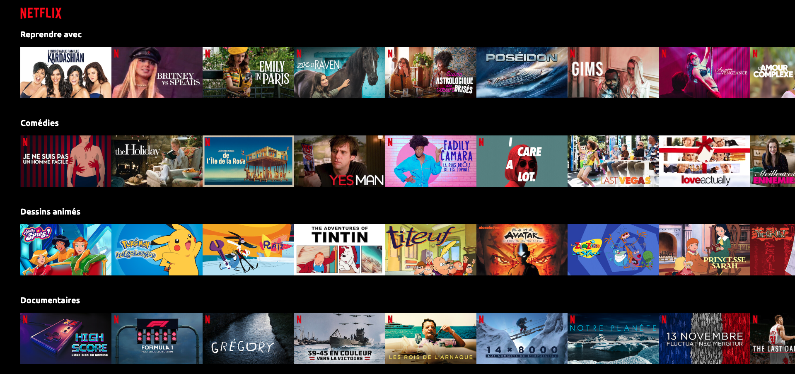

# Netlfix home page clone :heavy_plus_sign::zero: :heavy_minus_sign:

:date: January 2023  
:paintbrush: Frontend  
:link: Netlify check it [here](https://rad-kitsune-34e008.netlify.app/)

## Overview - Welcome :dog:

---

This project was made at [Le Reacteur](https://www.lereacteur.io/) Bootcamp.
1 screens is avalaible: Netflix home page desktop.

## Tasks :pencil2:

---

:ballot_box_with_check: Do integration (CSS and ReactJS)  
:ballot_box_with_check: Create components

## Stacks :books:

---

[Javascript](https://www.w3schools.com/js/default.asp)  
[ReactJS](https://fr.reactjs.org/docs/getting-started.html)  
[HTML5](https://www.w3schools.com/html/default.asp)  
[CSS3](https://www.w3schools.com/css/default.asp)

## Installation :hammer_and_wrench:

---

Be sure, you have installed all dependencies to run the project.

### Run the project :man_dancing:

1️. Clone this repository

`git clone https://github.com/KevinGent3/Netflix.git`

`cd Netflix`

2️. Install packages

`npm install`  
or  
`yarn`

3️. When installation is complete:

`yarn start`
